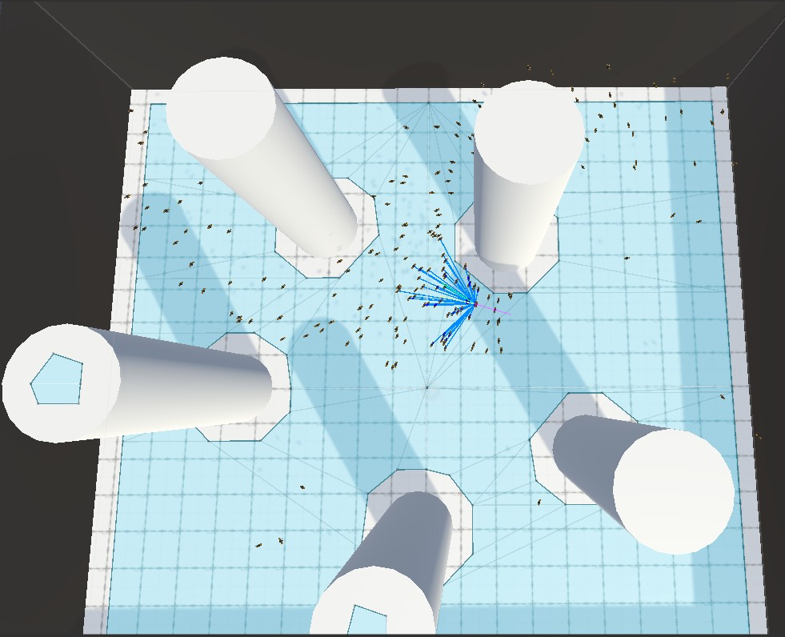
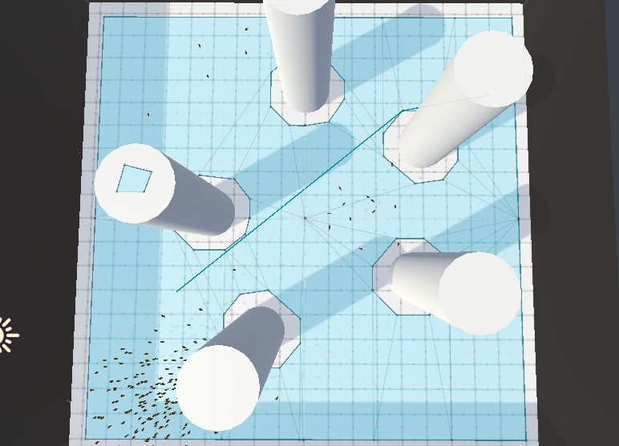
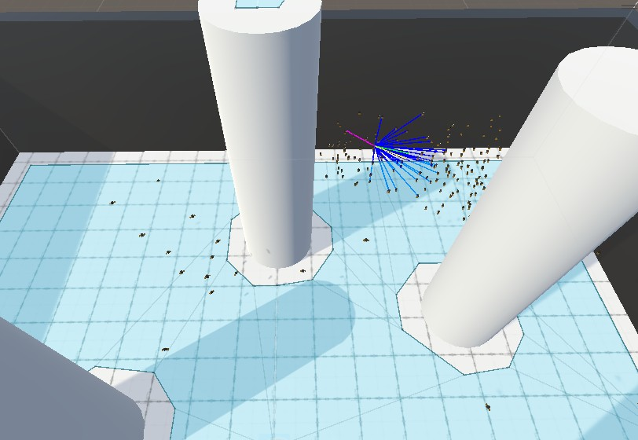

# BOIDS ALife Simulation
## Overview
Boids artificial life simulation made using C# and Unity engine to support an arbitrary number of autonomous agents with flocking behaviors including separation, cohesion, alignment, obstacle avoidance, and goal-driven navigation. Implemented modular steering and navigation systems with configurable behavior settings and Unity NavMesh integration to improve movement reliability and enable automated testing of multi-agent interactions. 

## Controls
- Keys: [Space] to make the red bug navigate to the set goal.

## Demo
- WebGL : https://accardonull.github.io/AISystems-main/
  
## Features
- Automatic initialization of the boids. All boids are randomly initialized within the initialization radius with a random forward heading within the forward random range

- Handling of the resetting of values at the top of the simulation loop

- Implementation of building the neighbour list, by simulating vision using distance and dot product

- Implementation of separation rule, alignment rule, cohesion rule, no neighbour wander rule, obstacles rule

- Addition of the world boundary to the obstacles rule

- The total forces are accumulated

-  A function that set the goal and calcuate a path to it for boidzero (the red bug) is implemented, implementing the behaviour triggered by using [Space] button. A check is made to ensure the processing of the path (navigating + ready + enough corners).

- The boid objects (the bugs) are updated and follow the path and heading of the boid particles

- The symplectic Euler integration scheme is implemented

## Screenshots
### Bird's-eye view

### Goal-driven Navgation line

### Debugging Visualization lines
- position between boids, Color.blue
- alignment, Color.green
- separation, Color.magenta
- cohesion, Color.yellow
- obstacle, Color.red 

## Tech Stack
- C#
- Unity Engine
- Visual Studio Code
